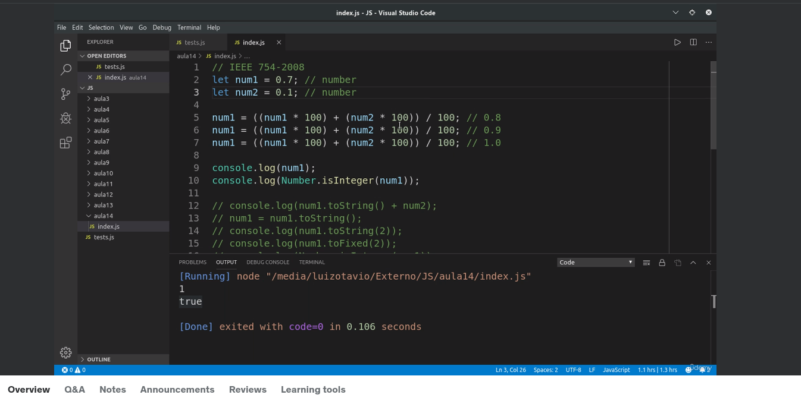

# Notas

Raiz quadrada

Jeito correto de realizar o exercicio de Numbers

## Array

## Slice

## Funções 

Não é possível chamar nada de dentro delas pois está dentro do _escopo da função_.

Nada é executado após return.

Caso não assuma um valor

Outra forma de criar uma função

Arrow Function

Simplificação dela 

objeto

Primitios e Referência

Exercício do Professor

## Coisas que retornam False - Curto circuito

if else

